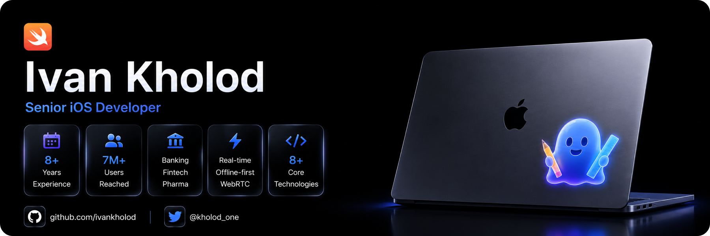
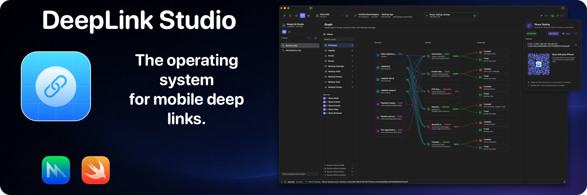
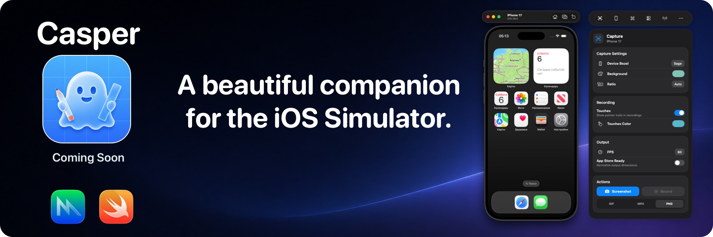
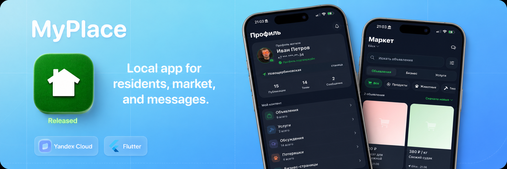

Senior Mobile Engineer with 8+ years of experience building production-grade applications from architecture to deployment.

I design and develop scalable mobile products, backend services and real-time systems with a strong focus on architecture, performance, reliability and user experience.

My experience spans banking, fintech, healthcare, communication platforms, offline-first systems and location-aware applications. I enjoy solving complex engineering problems, modernizing legacy codebases and building products that evolve from MVP to large-scale production.

Currently building an independent location-aware platform focused on scalable architecture, real-time messaging and cloud infrastructure.

🔹 Senior iOS Developer  
🔹 Swift · UIKit · SwiftUI · Async/Await · MVVM · Redux · VIPER+C  
🔹 Flutter · Dart · Kotlin · TypeScript · Go  
🔹 Backend: Node.js · PostgreSQL · Redis · WebSocket · Docker · Yandex Cloud  
🔹 Experience: Banking · Fintech · Healthcare · Real-time · Offline-first · Location-based Products  
🔹 Scale: 7M+ users · Payments · Credit Products · Live Data · WebRTC · Distributed Backend Systems

## My Products

## Languages & Tools

